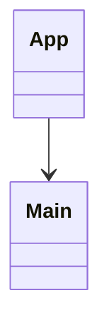

# Class Diagrams



```mermaid
classDiagram

%% Class definitions

class User {
  +String userID
  +String name
  +String email
  +String password
  +List<QuestionHistory> questionHistory
  +login()
  +register()
}

class Question {
  +String questionID
  +String questionText
  +String questionType
  +List<TestCase> testCases
  +submitAnswer()
  +getFeedback()
}

class QuestionHistory {
  +String questionID
  +String answer
  +Date timestamp
  +boolean isCorrect
  +String feedback
}

class Whiteboard {
  +String whiteboardID
  +String sessionID
  +void draw()
  +void erase()
}

class Microphone {
  +String micID
  +String sessionID
  +void startRecording()
  +void stopRecording()
  +String analyzeSpeech()
}

class AI {
  +String aiID
  +String sessionID
  +void analyzeHandwriting()
  +void provideFeedback()
  +void assistUser()
}

class Backend {
  +void handleAPIRequest()
  +void handleRealTimeComms()
}

class Frontend {
  +void renderUI()
  +void useCanvasAPI()
  +void useSVG()
}

%% Associations and relationships

User "1" --* "many" QuestionHistory : logs
User "1" --o "many" Whiteboard : uses
Whiteboard "1" --o "1" Microphone : has
Question "1" --o "many" TestCase : contains
Whiteboard "1" --|> Frontend : inherits
Microphone "1" --|> Backend : inherits
AI "1" --|> Backend : interfaces with
User "1" --o "many" AI : receives feedback from
Backend "1" --|> Flask
Backend "1" --|> Django
Frontend "1" --|> ReactJS
Explanation of the Diagram
Classes and Attributes:
User:

Attributes: userID, name, email, password, questionHistory
Methods: login(), register()
Question:

Attributes: questionID, questionText, questionType, testCases
Methods: submitAnswer(), getFeedback()
QuestionHistory:

Attributes: questionID, answer, timestamp, isCorrect, feedback
Whiteboard:

Attributes: whiteboardID, sessionID
Methods: draw(), erase()
Microphone:

Attributes: micID, sessionID
Methods: startRecording(), stopRecording(), analyzeSpeech()
AI:

Attributes: aiID, sessionID
Methods: analyzeHandwriting(), provideFeedback(), assistUser()
Backend:

Methods: handleAPIRequest(), handleRealTimeComms()
Frontend:

Methods: renderUI(), useCanvasAPI(), useSVG()
Relationships:
User and QuestionHistory: A user logs many question histories.
User and Whiteboard: A user uses many whiteboards.
Whiteboard and Microphone: A whiteboard has one microphone.
Question and TestCase: A question contains many test cases.
Whiteboard inherits Frontend: Indicates that the whiteboard UI is part of the frontend.
Microphone inherits Backend: Indicates microphone functionality is handled by the backend.
AI interfaces with Backend: AI functionalities are served via backend services.
User and AI: A user receives feedback from AI.
Backend interfaces with Flask and Django: Indicates that backend functionalities could be handled using Flask or Django.
Frontend interfaces with ReactJS: Indicates the frontend is built using ReactJS.
```
