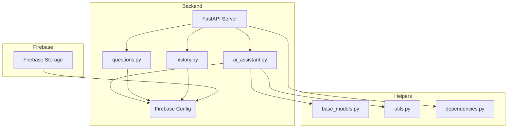

# Class Diagrams

## Front End Diagram


## Back End Diagram




## Components diagrams

```mermaid

classDiagram
    HomePage --> QuestionSelect : Navigates
    QuestionSelect --> DataTable : Uses
    QuestionSelect --> Whiteboard : Selects Question
    Whiteboard --> QuestionDisplay : Displays Question
    Whiteboard --> Editor : Provides Editing
    Whiteboard --> SubmitButton : Submits Response
    SubmitButton --> OralTest : Navigates
    OralTest --> ResponseImage : Displays Uploaded Response
    OralTest --> MicPrompt : Records Explanation
    OralTest --> API : Submits for Processing
    API --> Results : Provides Feedback
    Results --> FeedbackDisplay : Displays Feedback
    Results --> QuestionSelect : Allows Retry
    Results --> History : Provides Access
    Layout --> History : Navigates
    History --> DataTable : Displays History
    class HomePage {
        +navigateToQuestionSelect()
    }
    class QuestionSelect {
        +selectQuestion()
        +confirmSelection()
    }
    class DataTable {
        +renderTable()
    }
    class Whiteboard {
        +displayQuestion()
        +editResponse()
        +submitResponse()
    }
    class QuestionDisplay {
        +renderQuestion()
    }
    class Editor {
        +captureInput()
    }
    class SubmitButton {
        +triggerNavigation()
    }
    class OralTest {
        +displayResponse()
        +recordExplanation()
        +submitForAnalysis()
    }
    class ResponseImage {
        +renderImage()
    }
    class MicPrompt {
        +startRecording()
    }
    class API {
        +processData()
    }
    class Results {
        +displayFeedback()
        +retryQuestion()
    }
    class FeedbackDisplay {
        +renderFeedback()
    }
    class History {
        +displayHistory()
    }
    class Layout {
        +navigateToHistory()
    }


``` -->
