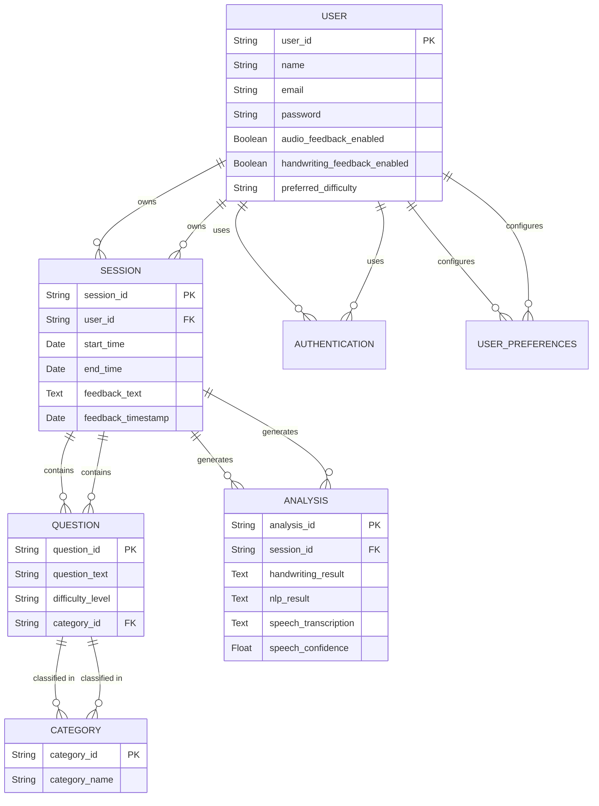

# Database Diagrams
## Entity-Relation Diagram

USER manages user authentication and profile information. 
SESSION manages user sessions, detailing each instance where a user engages with coding and estimation problems on the digital whiteboard (one-to-many with USER).  
QUESTION contains the coding and estimation problems available for user interaction within sessions, classified into categories (many-to-one with CATEGORY).  
CATEGORY organizes questions into distinct categories based on their content or difficulty level (one-to-many with QUESTION).  
ANALYSIS stores results from handwriting, speech, and natural language processing analysis related to user inputs during sessions (many-to-one with SESSION).  
FEEDBACK captures feedback provided to users based on their session performance, linked directly to SESSION (one-to-one with SESSION).  
USER_PREFERENCES holds user-configured settings that affect how the application behaves and interacts with the user, such as feedback options and interface preferences (one-to-one with USER).
