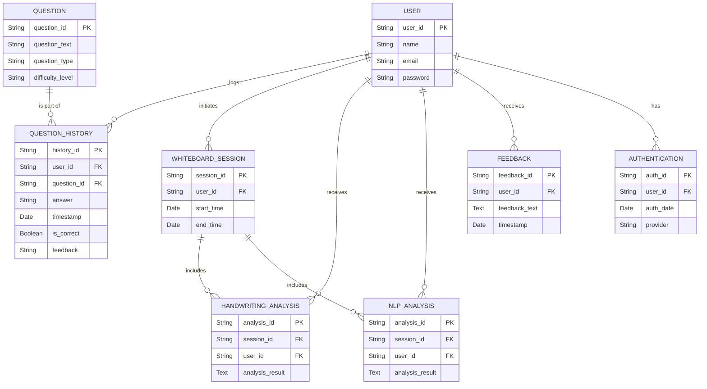

# Database Diagrams

```mermaid

erDiagram
%% Entities and their attributes

USER {
    String user_id PK
    String name
    String email
    String password
}

QUESTION {
    String question_id PK
    String question_text
    String question_type
    String difficulty_level
}

QUESTION_HISTORY {
    String history_id PK
    String user_id FK
    String question_id FK
    String answer
    Date timestamp
    Boolean is_correct
    String feedback
}

WHITEBOARD_SESSION {
    String session_id PK
    String user_id FK
    Date start_time
    Date end_time
}

HANDWRITING_ANALYSIS {
    String analysis_id PK
    String session_id FK
    String user_id FK
    Text analysis_result
}

NLP_ANALYSIS {
    String analysis_id PK
    String session_id FK
    String user_id FK
    Text analysis_result
}

FEEDBACK {
    String feedback_id PK
    String user_id FK
    Text feedback_text
    Date timestamp
}

AUTHENTICATION {
    String auth_id PK
    String user_id FK
    Date auth_date
    String provider
}

%% Relationships
USER ||--o{ QUESTION_HISTORY: "logs"
USER ||--o{ WHITEBOARD_SESSION: "initiates"
USER ||--o{ HANDWRITING_ANALYSIS: "receives"
USER ||--o{ NLP_ANALYSIS: "receives"
USER ||--o{ FEEDBACK: "receives"
USER ||--o{ AUTHENTICATION: "has"
QUESTION ||--o{ QUESTION_HISTORY: "is part of"
WHITEBOARD_SESSION ||--o{ HANDWRITING_ANALYSIS: "includes"
WHITEBOARD_SESSION ||--o{ NLP_ANALYSIS: "includes"
```
