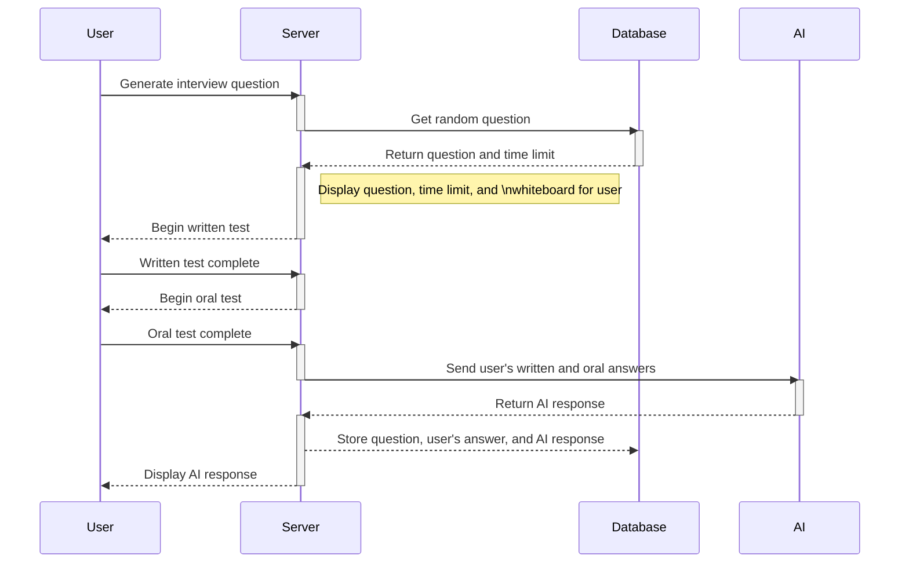

# Sequence Diagrams

## 1: Mock Interview

```mermaid

sequenceDiagram

participant User
participant Server
participant Database
participant AI

User->>Server:Generate interview question

activate Server
Server->>Database:Get random question
deactivate Server

activate Database
Database-->>Server:Return question and time limit
deactivate Database

activate Server
note right of Server:Display question, time limit, and \nwhiteboard for user
Server-->>User:Begin written test
deactivate Server

User->>Server:Written test complete

activate Server
Server-->>User:Begin oral test
deactivate Server

User->>Server:Oral test complete

activate Server
Server->>AI:Send user's written and oral answers
deactivate Server

activate AI
AI-->>Server:Return AI response
deactivate AI

activate Server
Server-->>Database:Store question, user's answer, and AI response
Server-->>User:Display AI response
deactivate Server

```
