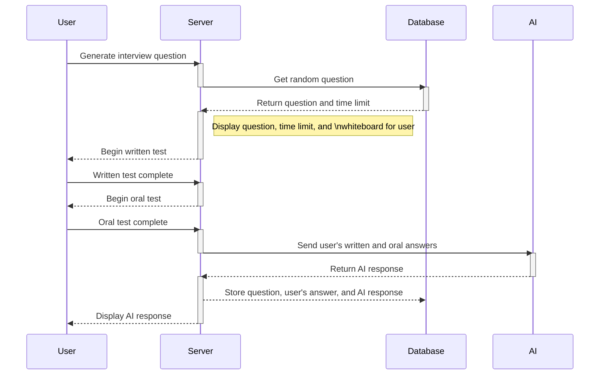
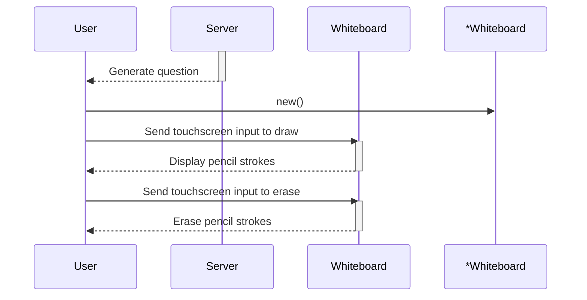
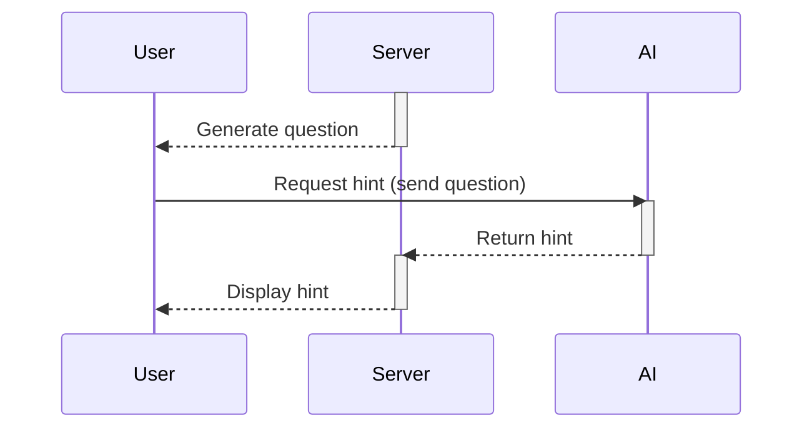
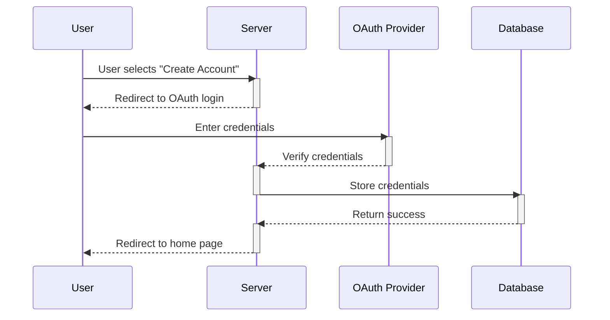
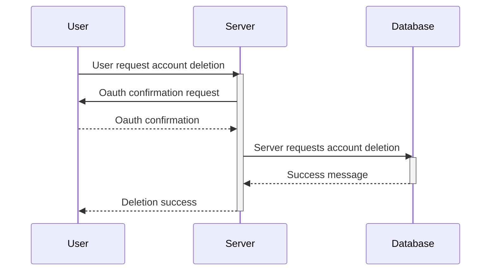
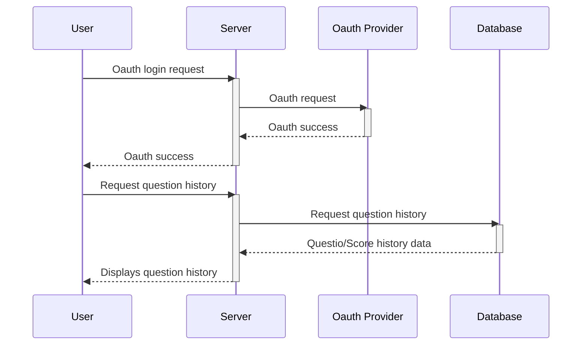
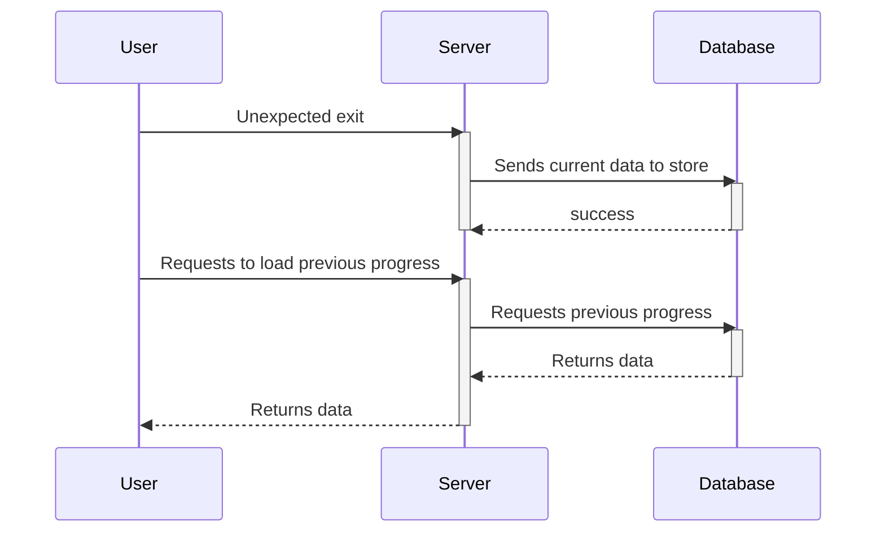

# Sequence Diagrams

## 1: Mock Interview

## 2: Digital Whiteboard

## 3: AI Assistant

## 4: Account Creation

## 5: Account Deletion

## 6: User Question History

## 7: Hints

## 8: Unexpected Exit

